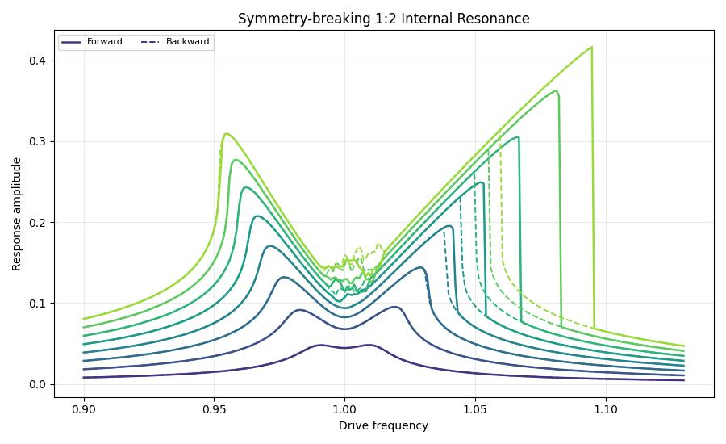

<p align="center">
  
</p>
<h2 align='center'>Fast Simulation of Nonlinear Oscillator Dynamics in Python</h2>

Poscidyn (Python oscillator dynamics) is a [JAX](https://github.com/google/jax)-based toolkit for **batched nonlinear time responses and frequency sweeps**. Its supported public workflow uses a solver instance: build the model and excitation once, then call `solver.time_response(...)` or `solver.frequency_sweep(...)`.

Features include:
- Time-response simulation
- Batched forward and backward synthetic frequency sweeps
- Nonlinear modal oscillators with quadratic and cubic stiffness
- JAX-oriented batching through `vmap`
---

## Installation
```bash
pip install poscidyn[gpu]
```
Requires Python 3.10 or newer.

## Documentation
Have a look at our extensive documentation on how to install, use and extend this package: [https://rknetemann.github.io/poscidyn/](https://rknetemann.github.io/poscidyn/).

## Quick example

```python
import jax.numpy as jnp
import poscidyn

oscillator = poscidyn.NonlinearOscillator(
    omega_0=jnp.array([1.0]),
    Q=jnp.array([80.0]),
    a=jnp.zeros((1, 1, 1)),
    b=jnp.array([[[[0.2]]]]),
)
excitation = poscidyn.DirectHarmonicExcitation(f_d=jnp.array([0.002]))
solver = poscidyn.TimeIntegration(
    oscillator=oscillator,
    excitation=excitation,
    response_measure=poscidyn.Demodulation(),
    multistart=poscidyn.LinearResponse(n_init_cond=8),
    n_time_steps=64,
)
result = solver.frequency_sweep(jnp.linspace(0.8, 1.2, 100))
```



The [documentation](https://rknetemann.github.io/poscidyn/) provides an
executable first sweep, a time-response quickstart, numerical guidance, and a
clear distinction between supported features and research directions.

## Credits where they are due

[JAX](https://github.com/google/jax): a Python library for accelerator-oriented array computation and program transformation, designed for high-performance numerical computing and large-scale machine learning.

[Diffrax](https://github.com/patrick-kidger/diffrax): JAX-based library providing numerical differential equation solvers.

[Equinox](https://github.com/patrick-kidger/equinox): your one-stop JAX library, for everything you need that isn't already in core JAX.
