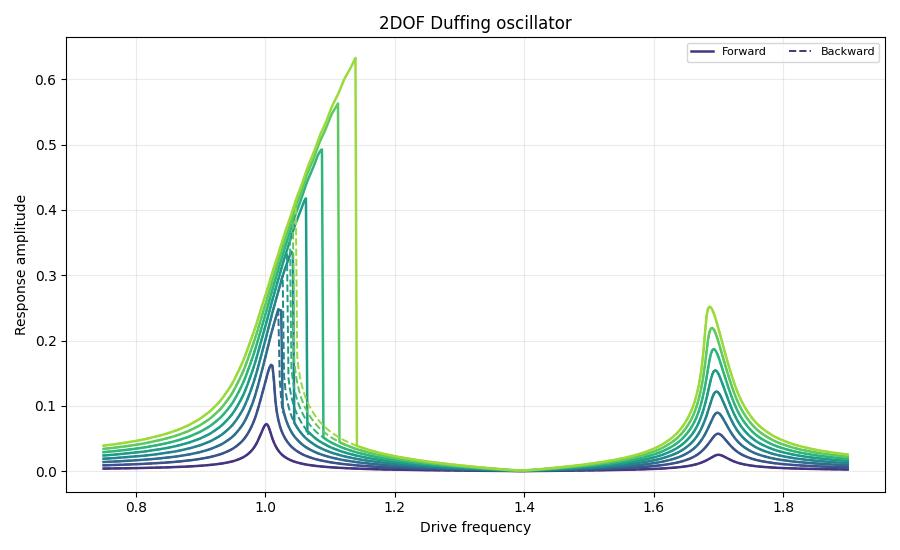

```python
import poscidyn
import numpy as np

# Function that estimates force to activate nonlinearity
def F_max(eta, omega_0, Q, b):
    return np.sqrt(
        4 * omega_0**6 / (3 * b * Q**2)
        * (eta + 1 / (2 * Q**2))
        * (1 + eta + 1 / (4 * Q**2))
    )

# Define system parameters
Q, omega_0, a, b = np.array([50.0, 50.0]), np.array([1.0, 1.7]), np.zeros((2, 2, 2)), np.zeros((2, 2, 2, 2))
b[0,0,0,0] = 1.0
b[1,1,1,1] = -1.0
modal_forces = np.array([1.0, 1.0])
modal_contributions = np.array([1.0, 1.0])

# Define sweep parameters
driving_frequency = np.linspace(0.75, 1.9, 512)
driving_amplitude = np.linspace(0.1, 1.0, 8) * F_max(0.3, omega_0[0], Q[0], b[0,0,0,0])

# Define classes
model = poscidyn.Nonlinear(Q=Q, a=a, b=b, omega_0=omega_0)
excitation = poscidyn.DirectExcitation(driving_frequency, driving_amplitude, modal_forces)
multistarter = poscidyn.LinearResponse(n_init_cond=32)
solver = poscidyn.TimeIntegration(max_steps=4096 * 8, n_time_steps=50, rtol=1e-4, atol=1e-7)
response_measure = poscidyn.Demodulation(multiples=(1,), modal_contributions=modal_contributions)

# Run the sweep
frequency_sweep = poscidyn.frequency_sweep(
    model = model, excitation=excitation, solver=solver, 
    response_measure=response_measure, multistarter=multistarter
) 

# Plotting
import matplotlib.pyplot as plt

forward = np.asarray(frequency_sweep.modal_superposition.amplitudes["forward"])
backward = np.asarray(frequency_sweep.modal_superposition.amplitudes["backward"])

colors = plt.cm.viridis(np.linspace(0.15, 0.85, len(driving_amplitude)))
fig, ax = plt.subplots(figsize=(9, 5.5))

for amp_idx, (drive_amp, color) in enumerate(zip(driving_amplitude, colors)):
    label_forward = "Forward" if amp_idx == 0 else None
    label_backward = "Backward" if amp_idx == 0 else None
    ax.plot(
        driving_frequency,
        forward[:, amp_idx],
        color=color,
        linewidth=1.8,
        label=label_forward,
    )
    ax.plot(
        driving_frequency,
        backward[:, amp_idx],
        color=color,
        linestyle="--",
        linewidth=1.4,
        label=label_backward,
    )

ax.set_title("2DOF Duffing oscillator")
ax.set_xlabel("Drive frequency")
ax.set_ylabel("Response amplitude")
ax.grid(alpha=0.25)
ax.legend(fontsize=8, ncol=2)
fig.tight_layout()
plt.show()
```

