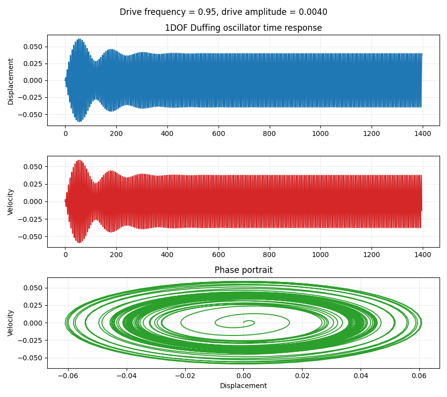

```python
import matplotlib.pyplot as plt
import numpy as np
import poscidyn


def F_max(eta, omega_0, Q, b):
    """Estimate a forcing scale large enough to activate the Duffing nonlinearity."""
    return np.sqrt(
        4 * omega_0**6 / (3 * b * Q**2)
        * (eta + 1 / (2 * Q**2))
        * (1 + eta + 1 / (4 * Q**2))
    )


# Define system parameters.
Q = np.array([50.0])
omega_0 = np.array([1.0])
a = np.zeros((1, 1, 1))
b = np.zeros((1, 1, 1, 1))
b[0, 0, 0, 0] = 1.0

modal_forces = np.array([1.0])
initial_displacement = np.array([0.0])
initial_velocity = np.array([0.0])

# Define a single-tone drive for a time response.
driving_frequency = np.array([0.95])
driving_amplitude = np.array([0.35 * F_max(0.2, omega_0[0], Q[0], b[0, 0, 0, 0])])

# Define classes.
model = poscidyn.Nonlinear(Q=Q, a=a, b=b, omega_0=omega_0)
excitation = poscidyn.DirectExcitation(
    drive_frequencies=driving_frequency,
    drive_amplitudes=driving_amplitude,
    modal_forces=modal_forces,
)
solver = poscidyn.TimeIntegration(
    max_steps=4096 * 8,
    n_time_steps=500,
    rtol=1e-5,
    atol=1e-7,
    t_steady_state_factor=1.0,
)

# Run the time response.
ts, xs, vs = poscidyn.time_response(
    model=model,
    excitation=excitation,
    initial_displacement=initial_displacement,
    initial_velocity=initial_velocity,
    solver=solver,
    precision=poscidyn.Precision.DOUBLE,
    only_save_steady_state=False,
)

# Plot displacement, velocity, and phase portrait.
t = np.asarray(ts)
x = np.asarray(xs[:, 0])
v = np.asarray(vs[:, 0])

fig, axes = plt.subplots(3, 1, figsize=(9, 8))

axes[0].plot(t, x, color="#1f77b4", linewidth=1.8)
axes[0].set_title("1DOF Duffing oscillator time response")
axes[0].set_ylabel("Displacement")
axes[0].grid(alpha=0.25)

axes[1].plot(t, v, color="#d62728", linewidth=1.6)
axes[1].set_ylabel("Velocity")
axes[1].grid(alpha=0.25)

axes[2].plot(x, v, color="#2ca02c", linewidth=1.4)
axes[2].set_xlabel("Displacement")
axes[2].set_ylabel("Velocity")
axes[2].set_title("Phase portrait")
axes[2].grid(alpha=0.25)

fig.suptitle(
    f"Drive frequency = {driving_frequency[0]:.2f}, "
    f"drive amplitude = {driving_amplitude[0]:.4f}",
    y=0.98,
)
fig.tight_layout()
plt.show()
```


