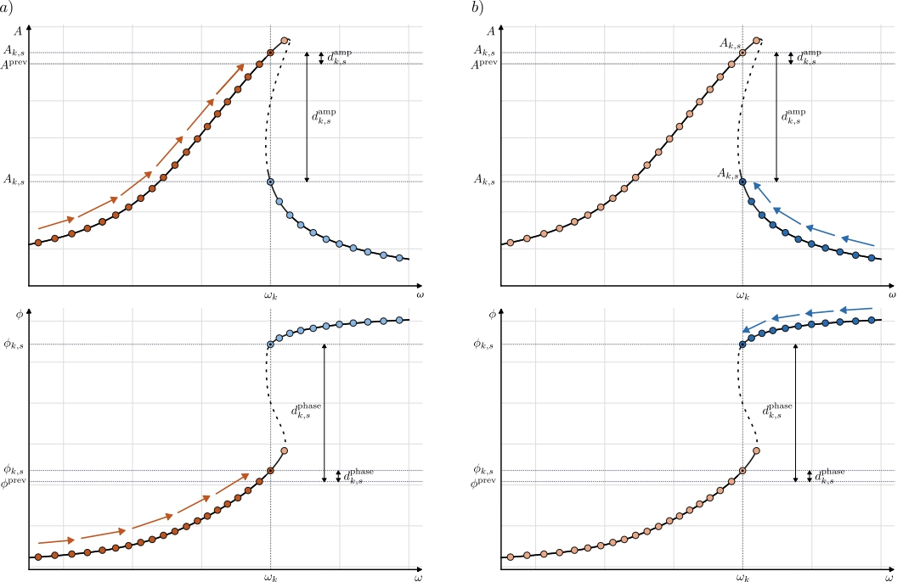

[<-- Go back to artificial sweeps](../start-here.md#artificial-sweeps)

# Nearest neighbour sweep

Let the candidate solutions at frequency step $k$ be indexed by $s = 1, \dots, N_{\mathrm{seeds}}$, with modal amplitude vector $\mathbf{A}_{k,s}$ and phase vector $\boldsymbol{\phi}_{k,s}$. The distance in amplitude to the previously selected solution is defined as

$$
d^{\mathrm{amp}}_{k,s}
=
\frac{
\sqrt{\frac{1}{M}\sum_{i=1}^{M}\left(A_{k,s,i} - A_i^{\mathrm{prev}}\right)^2}
}{
\sqrt{\frac{1}{M}\sum_{i=1}^{M}\left(A_i^{\mathrm{prev}}\right)^2} + \varepsilon
}.
$$

where $M$ is the number of response components and $\varepsilon$ is a small constant introduced to avoid division by zero.

To account for phase wrapping, the phase mismatch is evaluated using a circular distance:

$$
\Delta \phi_{k,s,i}
=
\arg\!\left(e^{j(\phi_{k,s,i} - \phi_i^{\mathrm{prev}})}\right).
$$

The corresponding normalized phase distance is

$$
d^{\mathrm{phase}}_{k,s}
=
\frac{
\sqrt{\frac{1}{M}\sum_{i=1}^{M}\left(\Delta \phi_{k,s,i}\right)^2}
}{\pi}.
$$

These two terms are combined into a total cost function

$$
d_{k,s}
=
d^{\mathrm{amp}}_{k,s}
+
w_{\phi}\, d^{\mathrm{phase}}_{k,s}
+
\lambda_{\mathrm{switch}}\, \mathbf{1}_{s \neq s^{\mathrm{prev}}}.
$$

where $w_{\phi}$ controls the relative importance of phase continuity and $\lambda_{\mathrm{switch}}$ penalizes switching to a different seed than the one selected at the previous step. The indicator function is defined as

$$
\mathbf{1}_{s \neq s^{\mathrm{prev}}}
=
\begin{cases}
1, & s \neq s^{\mathrm{prev}}, \\
0, & s = s^{\mathrm{prev}}.
\end{cases}
$$

The selected solution at frequency step $k$ is then

$$
s_k = \arg\min_s d_{k,s}.
$$

After selection, the reference state is updated according to

$$
\mathbf{A}^{\mathrm{prev}} \leftarrow \mathbf{A}_{k,s_k},
\qquad
\boldsymbol{\phi}^{\mathrm{prev}} \leftarrow \boldsymbol{\phi}_{k,s_k}.
$$

The sweep is initialized by selecting the medoid of the candidate amplitude vectors at the initial frequency step. In other words, the initial seed is chosen as the candidate whose average distance to all other candidates is minimal. Denoting the candidate amplitude vectors at $k=0$ by $\mathbf{A}_{0,s}$, this is written as

$$
s_0
=
\arg\min_s
\frac{1}{N_{\mathrm{seeds}}}
\sum_{r=1}^{N_{\mathrm{seeds}}}
d\!\left(\mathbf{A}_{0,s}, \mathbf{A}_{0,r}\right).
$$

where $d(\cdot,\cdot)$ is a distance measure between amplitude vectors. In the present work, the normalized root-mean-square distance is used:

$$
d\!\left(\mathbf{A}_{0,s}, \mathbf{A}_{0,r}\right)
=
\sqrt{
\frac{1}{M}
\sum_{i=1}^{M}
\left(A_{0,s,i} - A_{0,r,i}\right)^2
}.
$$

This initialization selects a representative candidate among the available responses while ensuring that the starting point corresponds to an actually computed solution.

Overall, this procedure can be interpreted as a greedy continuation method in frequency space. By minimizing the local mismatch in amplitude and phase between consecutive frequency steps, and by discouraging unnecessary switching between seeds, Poscidyn reconstructs smooth response branches that closely resemble experimentally measured frequency sweeps. The package therefore provides an efficient and experimentally relevant tool for generating large datasets of nonlinear frequency responses for subsequent machine-learning-based parameter identification.