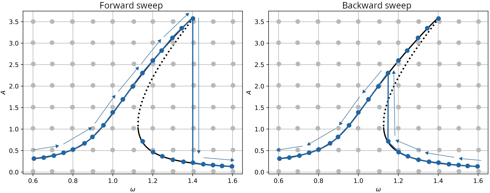

To get started with Poscidyn, only a few core concepts need to be understood. Poscidyn provides built-in classes for oscillator models (e.g. the [Duffing oscillator](https://en.wikipedia.org/wiki/Duffing_equation) and the [Van der Pol oscillator](https://en.wikipedia.org/wiki/Van_der_Pol_oscillator)) as well as excitation models (e.g. single-tone and multi-tone forcing). 

However, Poscidyn introduces a fundamentally different workflow compared to traditional continuation-based tools. To use the package effectively—and correctly—it is important to understand how it operates conceptually, and how it compares to established continuation and bifurcation analysis software such as [AUTO](https://sourceforge.net/projects/auto-07p/), [MATCONT](https://sourceforge.net/projects/matcont/), and [COCO](https://sourceforge.net/projects/cocotools/).

---

## Numerical frequency sweeping

In experiments, a frequency sweep is typically performed by slowly varying the excitation frequency while allowing the system to reach steady state at each step. Once steady state is reached, a response metric (e.g. amplitude) is recorded. 

This process must be **quasi-static**: if the frequency step is too large, the system may jump between coexisting solution branches.

In computational dynamics, this procedure is known as **continuation**. Software packages such as [AUTO](https://sourceforge.net/projects/auto-07p/), [MATCONT](https://sourceforge.net/projects/matcont/), and [COCO](https://sourceforge.net/projects/cocotools/) are specifically designed for this purpose. They are widely used for analyzing:

- bifurcations  
- limit cycles  
- frequency response curves  

A key limitation of continuation methods is that they are inherently **sequential**. Each solution depends on the previous one, which:

- limits parallelization  
- increases computation time for large problems  

Additionally, many of these tools are built in environments such as [MATLAB](https://www.mathworks.com/products/matlab.html) or [FORTRAN](https://fortran-lang.org/), which may limit accessibility and flexibility.

---

## Poscidyn approach: multistart + artificial sweeps

Poscidyn takes a fundamentally different approach.

Instead of following a single solution branch, it computes many steady-state responses **in parallel** using a **multistart strategy**. For each excitation condition, the system is simulated from a large set of initial conditions. This typically reveals **multiple coexisting attractors** at the same frequency.

While this approach is computationally intensive, it is highly parallelizable and often faster in practice on modern hardware.

However, experiments typically observe only a **single branch**. To bridge this gap, Poscidyn introduces **artificial sweep methods**, which:

- select one solution per frequency  
- enforce continuity in amplitude–phase space  
- reconstruct continuation-like curves  

In addition, Poscidyn provides several **response measures** (e.g. demodulation, extrema, \(L^2\) metrics) to extract physically meaningful quantities from the simulated signals.

Future development aims to include hybrid approaches combining continuation and parallel methods (see [Future work](../../future-work)).

---

## Multistarting

For each combination of drive frequency and amplitude, Poscidyn defines a search space of initial conditions. From this space, \(\texttt{n\_init\_cond}\) initial conditions are sampled.

This increases the probability of capturing all relevant stable attractors.

The search space is defined as:

$$
\begin{aligned}
x_{0,i} &\in [-x_{\max,i},\, x_{\max,i}], \\
v_{0,i} &\in [-v_{\max,i},\, v_{\max,i}],
\end{aligned}
$$

Increasing \(\texttt{n\_init\_cond}\) improves coverage of the state space and is therefore a key simulation hyperparameter.

Currently, Poscidyn supports one method to determine these bounds:

- [Linear response operating range](../multistarting/linear-response): based on the linear response at resonance.

---

## Artificial sweeps

At a given frequency, multiple steady-state responses may exist due to different basins of attraction. In contrast, experiments typically observe only a single response.

Poscidyn reconstructs a synthetic sweep by selecting one solution per frequency such that the resulting curve remains continuous in amplitude–phase space. This is analogous to continuation.

Currently implemented:

- [Nearest neighbour method](../artificial-sweeps/nearest-neighbour):  
  selects solutions by minimizing local amplitude–phase mismatch between consecutive frequency steps, while penalizing unnecessary switching between initial condition seeds.

---

## Response measures

Poscidyn provides multiple ways to extract response characteristics from steady-state signals:

- [Demodulation](../response-measures/demodulation):  
  computes amplitude and phase via discrete Fourier components at multiples of the drive frequency  

- [Minimum and maximum](../response-measures/min-max):  
  extracts extrema of the steady-state signal  

- [L2](../response-measures/l2):  
  computes the root-mean-square (RMS) amplitude, corresponding to a normalized \(L^2\) norm  

---

## Solvers

Currently, Poscidyn computes steady-state responses using time integration.

The system is defined as:

$$
\dot{\mathbf{x}}(t) = \mathbf{f}(\mathbf{x}(t), t),
\qquad
\mathbf{x}(t_0) = \mathbf{x}_0
$$

with solution:

$$
\mathbf{x}(t) = \boldsymbol{\Phi}(t; t_0, \mathbf{x}_0)
$$

Implemented method:

- [Time integration]():  
  integrates the system (e.g. Runge–Kutta methods) until steady-state is reached for each initial condition  

---

## Limitations

Synthetic sweep methods approximate continuation behaviour but are not equivalent to true continuation algorithms. Important limitations and caveats are discussed on the [Limitations](../../getting-started/limitations) page.