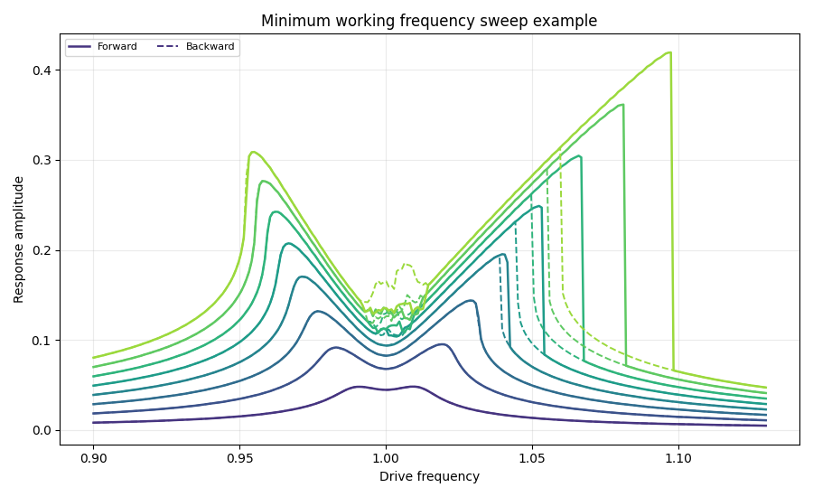

# Poscidyn in a nutshell

Poscidyn (Python oscillator dynamics) is a Python toolkit based on [JAX](https://github.com/google/jax), designed to **streamline and accelerate time-response and frequency-sweep simulations**. It leverages novel parallelization strategies to gain a speed advantages over standard continuation software.

Features include:

- Frequency sweep simulation (forward and backward)
- Time-response simulation
- Built-in models of (nonlinear) oscillators
- Everything vmappable (batchable)

!!! note

    This project is in its early stages, some functionality is missing, some docs are missing and/or might not yet fully align with the (future) API. 

## Quick example

A two-degree-of-freedom oscillator including nonlinear coupling and duffing nonlinearity:

$$
\begin{align}
  \ddot q_1 + \frac{\omega_{0,1}}{Q_1} \dot q_1 + \omega^2_{0,1} q_1 
  + a^{(1)}_{12} q_1 q_2 + b^{(1)}_{111} q_1^3 
  &= f_1 \cos(\omega t), \\
  \ddot q_2 + \frac{\omega_{0,2}}{Q_2} \dot q_2 + \omega^2_{0,2} q_2 
  + a^{(2)}_{11} q_1^2 
  &= f_2 \cos(\omega t),
\end{align}
\label{eq:symmetry-breaking-model}
$$


```python
import poscidyn
import numpy as np

Q, omega_0, a, b = np.array([50.0, 50.0]), np.array([1.00, 2.00]), np.zeros((2, 2, 2)), np.zeros((2, 2, 2, 2))
a[0,0,1] = 2.0
a[1,0,0] = 1.0
b[0,0,0,0] = 1.0
modal_forces = np.array([1.0, 1.0])
modal_contributions = np.array([1.0, 1.0])

driving_frequency = np.linspace(0.9, 1.13, 256)
driving_amplitude = np.linspace(0.1, 1.0, 8) * 0.0144

model = poscidyn.NonlinearOscillator(Q=Q, a=a, b=b, omega_0=omega_0)
excitation = poscidyn.OneToneExcitation(driving_frequency, driving_amplitude, modal_forces)
solver = poscidyn.TimeIntegrationSolver(max_steps=4096 * 20, n_time_steps=100, rtol=1e-5, atol=1e-7, t_steady_state_factor=2.0)
response_measure = poscidyn.Demodulation(multiples=(1,), modal_contributions=modal_contributions)

frequency_sweep = poscidyn.frequency_sweep(
    model = model, excitation=excitation, solver=solver, response_measure=response_measure, precision=poscidyn.Precision.DOUBLE
) 
```

When plotting the total response (superposition of modes):



## For who is Poscidyn?

If you want to know more for who Poscidyn could be a useful package, have a look at the [For who is Poscidyn?](../for-who-is-poscidyn) page.

## Credits where they are due

[JAX](https://github.com/google/jax): a Python library for accelerator-oriented array computation and program transformation, designed for high-performance numerical computing and large-scale machine learning.

[Diffrax](https://github.com/patrick-kidger/diffrax): JAX-based library providing numerical differential equation solvers.

[Equinox](https://github.com/patrick-kidger/equinox): your one-stop JAX library, for everything you need that isn't already in core JAX.